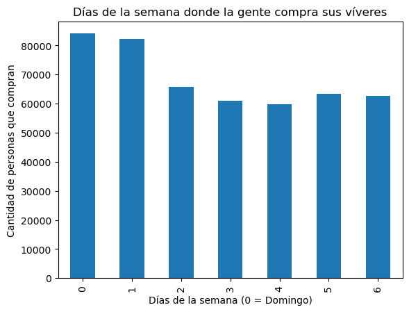
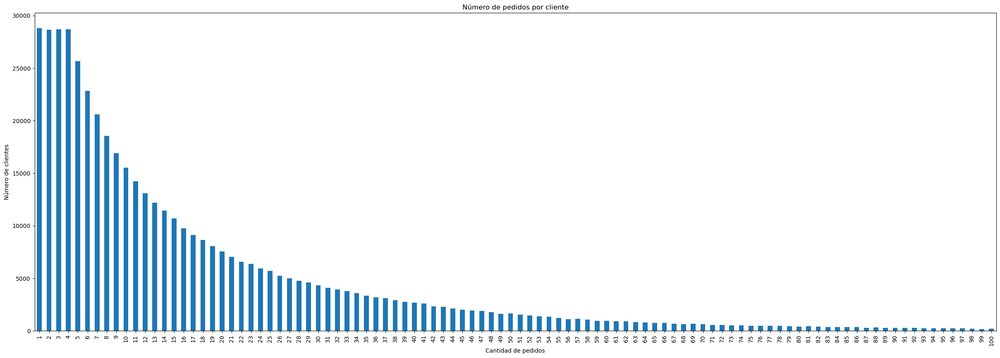
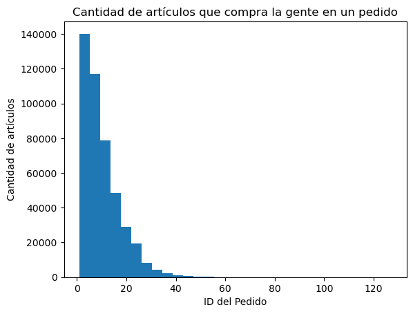

## **
<b>Patrones de compra y comportamiento de clientes en Instacart</b>
**

### **Introducción**

En el presente proyecto se analizan hábitos de compra de los clientes de Instacart mediante técnicas de preprocesamiento de datos y análisis exploratorio (EDA) para identificar patrones en los pedidos, frecuencia de compra, productos más populares y comportamiento de recompra.

Instacart es una plataforma de entregas de comestibles donde la clientela puede registrar un pedido y hacer que se lo entreguen, similar a Uber Eats y Door Dash.

### **Datasets utilizados**

- <b>Pedidos en la aplicación</b>: Cada fila corresponde a un pedido en la aplicación Instacart. 
([instacart_orders]()) 

- <b>Productos</b>: Cada fila corresponde a un producto único que pueden comprar los clientes.
([products]()) 

- <b>Artículos</b>: Cada fila corresponde a un artículo pedido en un pedido..
([order_products]()) 

- <b>Categoría</b>: Categoría de pasillo de víveres.
([aisles]()) 

- <b>Departamento</b>: Departamento de víveres.
([departments]()) 

### **Análisis**

Después de realizar un análisis exploratorio de datos y un preprocesamiento, destacamos los siguiente resultados:

- El domingo es el día en el que las personas más hacen compras, seguido del lunes. El día en que menos compras realizan es el jueves. Además, se realizan más pedidos a las 15:00.

  

- El número de pedidos por clientes muestra una distribución sesgada a la derecha. Esto nos dice que la mayoría de las personas hace pedidos bajos. Además, el número de pedidos que en promedio hacen los clientes van desde 1 hasta 8 aproximadamente.

  

- Hay pedidos muy grandes. El más pequeño oscila entre 50 productos.

  

### **Conclusión**

Las bases de datos proporcionadas nos permitieron aplicar métodos, funciones y gráficos para obtener respuestas a ciertas cuestiones.

Primero que nada, obtuvimos una descripción de los datos para saber como se componen.

Posteriormente,preprocesamos los datos en donde verificamos y corregimos errores o datos inconsistente como los ausentes o duplicados.

Al realizar análisis, obtuvimos algunos resultados relevantes, por ejemplo, las personas realizan más pedidos de 10:00 am a 4:00pm, se realizan más compras los domingos, los clientes no esperan muchos días para realizar otro pedido, el número de pedidos que en promedio hacen los clientes van desde 1 hasta 8 aproximadamente, el producto más pedido son Bananas y Bag of organic bananas y son uno de los productos que las personas ponen primero en su carrito.

Además, se conoció la proporción de veces que pide y que vuelve a pedir un cliente y la proporción de productos que ya han pedido.

Finalmente, los hábitos de las personas sobre compras en Instacart son similares, siguen un patrón y posiblemente pueden variar en distintas épocas del año.